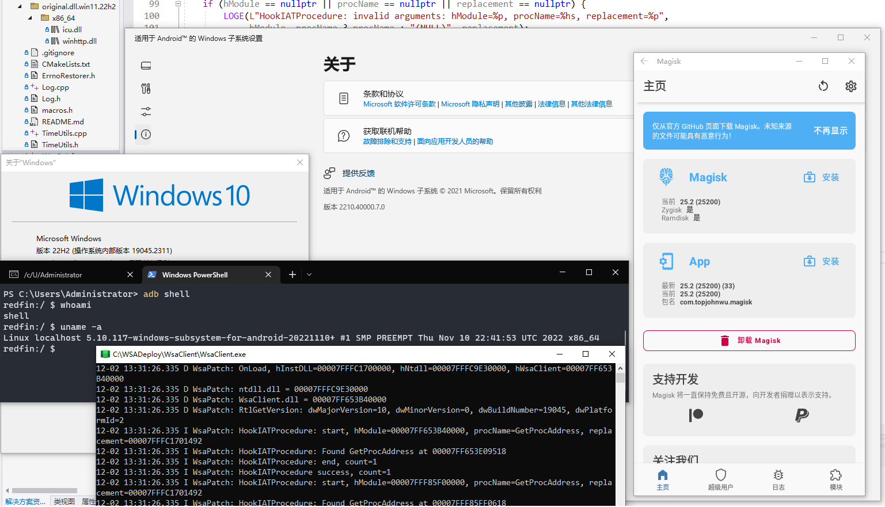

# 适用于 Windows 10 的 WSA 补丁

[English version](./README.md)

这是一个可以让 Windows 10 运行 WSA (Windows Subsystem for Android) 的补丁及其使用方法。

本人测试过 Windows 10 22H2 10.0.19045.2311 x64 + WSA 2210.40000.7.0 以及 10.0.19045.2364 + 2211.40000.10.0.

### 操作步骤

1. 将你的系统更新到 Windows 10 22H2 10.0.19045.2311 或更高版本.
    - 你可以通过 `winver` 命令查看您当前的 Windows 版本.
    - 如果您的 Windows 版本低于 10.0.19045.2311, 请将您的系统更新到 10.0.19045.2311 或以上.
2. 安装 WSL2 (我用的 Ubuntu 22.04 LTS, 当然你也可以选择你喜欢的发行版，下一步要用到).
3. 按照 https://github.com/LSPosed/MagiskOnWSALocal 的步骤，得到集成了 Magisk 的 WSA AppX 包.
    - 注：你需要在你的 WSL2 里进行操作，WSA 版本建议选 Insider Fast/Dev Channel.
4. 把你的 WSA AppX 包从 WSL2 里复制出来, 它应该是一个压缩包, 解压到你希望安装 WSA 的地方.
    - 位于 `MagiskOnWSALocal/output`, 文件名类似于 `WSA-with-magisk-stable-MindTheGapps_2210.40000.7.0_x64_Release-Nightly.7z`.
5. 用 Visual Studio 编译本仓库的代码，得到 WsaPatch.dll (用 MSVC 工具链编译，如果你不想自己编译，你可以去 release 里下).
6. 想办法从 Windows 11 22H2 的 System32 里复制一个 icu.dll 过来，找一个 PE32+ 编辑工具给它的导入表加一个 WsaPatch.dll.
    - 你必须用 Windows 11 22H2 里的 icu.dll, 因为 Windows 10 的 icu.dll 缺符号;
    - 如果你没有 Windows 11 22H2, 本仓库的 original.dll.win11.22h2 就有原版带微软签名的 icu.dll;
    - 如果你不想自己搞，你可以用 release 里已经修改过的 icu.dll.
7. 把编译好的 WsaPatch.dll 和修改过的 icu.dll 复制到 WSA 的 WsaClient 文件夹.
8. 按以下要求修改 AppxManifest.xml:
    1. 在 `AppxManifest.xml` 找到 `TargetDeviceFamily` 节点
       ```xml
       <TargetDeviceFamily Name="Windows.Desktop" MinVersion="10.0.22000.120" MaxVersionTested="10.0.22000.120"/>
       ```

       把 `MinVersion` 从 `10.0.22000.120` 改成 `10.0.19045.2311`.

    2. 在 `AppxManifest.xml` 删除 "customInstall" 相关节点，一共有两个.
       找到以下内容，然后删掉.

       ```xml
       <rescap:Capability Name="customInstallActions"/>
       ```

       ```xml
       <desktop6:Extension Category="windows.customInstall">
           <desktop6:CustomInstall Folder="CustomInstall" desktop8:RunAsUser="true">
               <desktop6:RepairActions>
                   <desktop6:RepairAction File="WsaSetup.exe" Name="Repair" Arguments="repair"/>
               </desktop6:RepairActions>
               <desktop6:UninstallActions>
                   <desktop6:UninstallAction File="WsaSetup.exe" Name="Uninstall" Arguments="uninstall"/>
               </desktop6:UninstallActions>
           </desktop6:CustomInstall>
       </desktop6:Extension>
       ```

9. 运行 `Run.bat` (需要管理员权限).

编译好的 WsaPatch.dll 和修改过的 icu.dll 可以从 [release 页面](https://github.com/cinit/WSAPatch/releases) 下载.

### 注意事项

1. WSA 只能安装在 NTFS 分区 (请勿安装在 exFAT 分区).
2. 在 `Add-AppxPackage -Register .\AppxManifest.xml` 完成 WSA 的安装后, 你原先解压 WSA 的文件夹不可以删除.
   因为 `Add-AppxPackage -Register .\AppxManifest.xml` 的作用是注册 appx 应用包，它只登记注册，不会复制文件.
   参考 https://learn.microsoft.com/en-us/powershell/module/appx/add-appxpackage?view=windowsserver2022-ps
3. 在解压 WSA 后第一次启动之前, 你需要注册 WSA appx 包 (上文第 9 步).
   对于 [MagiskOnWSALocal](https://github.com/LSPosed/MagiskOnWSALocal) 用户, 你只需要运行解压目录下的 `Run.bat` 即可.
   如果报错失败, 你可以进行以下操作进行错误诊断(需要管理员权限).
    1. 以管理员身份打开 PowerShell, 切换工作目录到 WSA 的解压目录.
    2. 在 PowerShell 中运行 `Add-AppxPackage -ForceApplicationShutdown -ForceUpdateFromAnyVersion -Register .\AppxManifest.xml`.
       该命令应该会失败并提供一个这次错误的 ActivityID (是个 UUID).
    3. 在 PowerShell 中运行 `Get-AppPackageLog -ActivityID <UUID>` 获取刚才的错误的日志.
    4. 根据日志的内容进行修复.

#### 关于 winhttp.dll

- WsaClient.exe 会用 GetProcAddress 从 winhttp.dll 动态获取一些符号.
- 有些符号是只有在 Windows 11 的 winhttp.dll 里才有，Windows 10 的 winhttp.dll 缺少这些符号.
- 如果你在 WsaClient 文件夹建一个名为 `EnableDebugConsole` 的文件(没有扩展名)或者把 [WsaPatch.cpp](WsaPatch.cpp) 里的 `wsapatch::kDebug` 改成 true,
  你能看到 GetProcAddress 有些结果是 NULL.
- 如果你找一个 Windows 11 22H2 的 winhttp.dll 放到 WsaClient 文件夹里(或者 WSA 安装目录)，WsaClient.exe 就能找到这些符号了.
- 但是不管 WsaClient.exe 能否找得到这些符号，它都能用.

```text
12-10 16:16:29.474 W WsaPatch: -GetProcAddress: hModule=C:\WINDOWS\SYSTEM32\WINHTTP.dll(00007FFC64780000), lpProcName=WinHttpRegisterProxyChangeNotification, result=NULL
12-10 16:16:29.474 W WsaPatch: -GetProcAddress: hModule=C:\WINDOWS\SYSTEM32\WINHTTP.dll(00007FFC64780000), lpProcName=WinHttpUnregisterProxyChangeNotification, result=NULL
12-10 16:16:29.474 W WsaPatch: -GetProcAddress: hModule=C:\WINDOWS\SYSTEM32\WINHTTP.dll(00007FFC64780000), lpProcName=WinHttpGetProxySettingsEx, result=NULL
12-10 16:16:29.474 W WsaPatch: -GetProcAddress: hModule=C:\WINDOWS\SYSTEM32\WINHTTP.dll(00007FFC64780000), lpProcName=WinHttpGetProxySettingsResultEx, result=NULL
12-10 16:16:29.474 W WsaPatch: -GetProcAddress: hModule=C:\WINDOWS\SYSTEM32\WINHTTP.dll(00007FFC64780000), lpProcName=WinHttpFreeProxySettingsEx, result=NULL
```

### 可能遇到的问题

1. 如果老版本的 WSA 2209.40000.26.0 开了开发者模式也连不上 ADB (端口没有进程监听), 更新到 WSA 2210.40000.7.0 就可以了.
2. 移动 WSA 的设置窗口可以通过按住窗口最小化按钮左边的一小块空白区域然后拖动, 也可以通过按快捷键 Alt+Space 然后点弹出菜单里的 "移动".
   [#1](https://github.com/cinit/WSAPatch/issues/1) [#2](https://github.com/cinit/WSAPatch/issues/2)
3. 如果你的 WSA 在启动时闪退且没有任何提示，请将 Windows 10 更新到 22H2 10.0.19045.2311 或更高版本.
   (有人反应过 WSA 在 22H2 19045.2251 闪退, 但更新到 22H2 19045.2311 就能用了).

如果你遇到了其他问题或者有什么建议，欢迎在 Issue/PR 中提出.

### 截图


